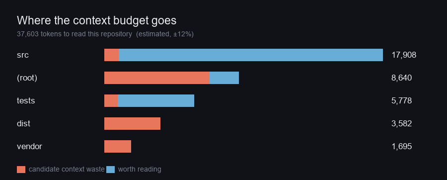
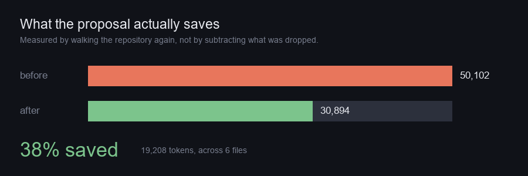

# contextcost

[](https://github.com/CAOShurong/contextcost/actions/workflows/ci.yml)
[](https://pypi.org/project/contextcost/)
[](LICENSE)
[](pyproject.toml)

**What does this repository cost an AI coding agent to read, and what is
wasting that budget?**

Point it at a repository. It measures what reading that repository costs in
tokens, works out which files are spending that budget without earning it, and
then — the part nobody else does — **applies its own proposal and measures the
result again**, so the saving it reports is a difference between two
measurements rather than a sum of its own opinions.

```console
$ contextcost .

contextcost  ~/work/example

  74,318 tokens to read this repository   ±12% estimated, no tokenizer
  12 text files · 1 binary not counted · 3 paths ignored

WHERE IT GOES
  (root)                    41,882  ████████████████████████████  56%
  vendor                    12,704  ████████·····················  17%
  src                        9,331  ██████·······················  13%

CANDIDATE CONTEXT WASTE
  certain  lockfile         38,905  1 file
             38,905  package-lock.json
                      package-lock.json is written by a package manager
  likely   vendored         12,704  2 files
             7,110  vendor/legacy/helpers.js
                      inside a directory named vendor/

SAVING
  74,318 → 15,033 tokens   80% saved
  Measured by walking the repository again with the proposal applied,
  not by subtracting what was dropped.

  Add to .gitignore (or run with --write-gitignore):
    /package-lock.json
    /vendor/
```

## Install

```bash
pip install contextcost
```

No dependencies. Python 3.9+.

## Why this exists

Every coding agent — Claude Code, Cursor, Codex, Copilot Workspace, an
in-house one — spends part of its context window just working out what is in
your repository. That budget is finite and it is charged per token, and most
repositories quietly spend a large fraction of it on files that often add
little to an ordinary source-code task: lockfiles, minified bundles, vendored
dependencies, snapshot fixtures, generated clients.

The first repository this was ever pointed at had **55% of its entire context
cost in a single generated CSV**.

There are good tools for *packing* a repository into a prompt — repomix,
gitingest, code2prompt, files-to-prompt. This is not one of them. Packing is a
solved and crowded problem. Auditing what the packing will cost you, and
reducing it with evidence, was not.

## What it will not do

Stated up front, because a tool that measures something is only useful if you
know where its numbers stop.

**It does not use a real tokenizer.** An exact count needs `tiktoken` — a
compiled dependency with a wheel per platform. A tool whose pitch is "find out
what your repo costs in ten seconds" cannot open with a build toolchain. So it
approximates by character class and **prints its error bound next to every
total**.

That bound is measured, not asserted. `docs/calibrate.py` encodes a corpus with
`cl100k_base` and compares:

| | error vs. a real tokenizer |
| --- | ---: |
| median file | 3.1% |
| 95th percentile | 10.8% |
| whole corpus (what a repository total looks like) | 6.3% |

The bound the tool actually prints is **±14%**: the measured 95th percentile
plus 20% headroom. The corpus is this repository's own files, so every commit
changes it slightly, and a bound sitting exactly on the measurement would turn
ordinary editing into a red build — where the tempting fix is to widen the
bound, which is how a number stops meaning anything.

Two caveats that belong here rather than in a footnote. **It is one
tokenizer** — Anthropic and most others do not publish theirs, so this is a
proxy, and "byte-pair encoders land close to each other" is doing real work in
that sentence. And **the corpus is this repository's own files** plus synthetic
dense and CJK samples; it is real code and real prose, but it is not yours.

### CJK is counted per script, not as one thing

Charging Chinese at the Latin rate under-counts it roughly threefold, so CJK
has always been counted separately. What was wrong until recently is that it
was counted as *one* category, and the scripts are not close to each other:

| script | tokens per character |
| --- | ---: |
| Japanese kana | 0.85 |
| Korean hangul | 1.10 |
| Chinese, simplified | 1.08 |
| **Chinese, traditional** | **1.55** |

Traditional Chinese costs 44% more per character than simplified for the same
sentence, because the tokenizer has far fewer merges for it. A single constant
under-counted it by 30% — and traditional is what this project's author writes
documentation in, so the first real user would have been the one mis-billed.

Simplified and traditional share a Unicode block, so they are told apart by
looking for characters that exist only in the traditional set. Measured on
prose: 27% of traditional Han characters trip that detector, and 0% of
simplified ones.

### Numeric data dumps are their own class

Running `--accurate` against [plotly.js](https://github.com/plotly/plotly.js)
exposed the estimator's next blind spot: it read 45 M tokens where the
tokenizer said 64 M. The gap was not source code — it was recorded test
fixtures and JSON number matrices, files whose bodies are thousands of small
integers (`gl2d_parcoords_blocks.json` was under-counted by 71%). A byte-pair
encoder merges digits poorly, so the more of a file is digits, the more
tokens per character it costs — the opposite of what the code ratio assumed.

Files that are mostly digits now form a `numeric` class with its own ratio,
derived from the measured digit share. On plotly.js this took the whole-tree
error from **29.4% to 1.2%**; on astropy from 20.8% to 12.6%; h5py and pandas,
which have almost no such files, were unchanged. The class is conservative on
purpose — a file qualifies only if it already looked like code, at least 10%
of it is digits, letters are under 25%, and the digits outnumber the letters —
so ordinary number-heavy source stays on the code path.

For most of this project's life that bound read `±12%`, and it had been chosen
rather than measured — the comment beside it cited a calibration script that
did not exist. When the script was finally written, the true figure was more
than four times worse, and fixing the ratios it exposed (source code is 4.14
characters per token, not the 3.15 that had been reasoned out; dense content is
bimodal and no single ratio fits it) is what produced the table above. That is
recorded in `estimate.py` rather than quietly corrected, because a tool that
argues against unverified numbers should say when it shipped one.

**It will not decide the ambiguous cases for you.** Findings carry a
confidence: `certain` (the file says what it is, or its name is reserved by
the tool that wrote it), `likely` (a strong path convention), and `possible`.
Confidence describes the evidence for the file's category, **not universal
irrelevance**: a lockfile is machine-written with certainty and can still be
essential during a dependency upgrade. Read the proposal in the context of
the work you use the agent for.
That last tier — mostly large data files — is **never excluded automatically**,
because a large CSV is waste in a web app and is the entire subject in an
analysis repository, and nothing visible from the file system tells those
apart. Those are listed separately, with the rule's reasoning, for you to
judge. `--include-possible` moves them in.

**It never edits your repository unless you ask.** The default output is a
proposal. `--write-ignore` targets the selected consumer's native ignore file;
`--write-gitignore` remains available as an explicit compatibility option.
Write mode refuses a symbolic-link destination instead of following it beyond
the repository boundary.

**`.contextcostignore` — exclusions that belong to the measurement alone.**
The right exclusion for an AI context budget is often wrong everywhere else: a
recorded test fixture should reach an agent and stay tracked by Git.
`contextcost --emit-ignore` writes the verified proposal into this
project-local file, which contextcost reads for every consumer (even with
`--no-gitignore`) and applies **last**, so its patterns win — including `!`
re-inclusions, if you want to rescue files from a broader rule. Accepting a
saving is one command and changes nothing outside this tool's own measurement.

**It does not reproduce a live product's prompt or bill.** Consumer profiles
model documented ignore-file inputs: the set of text files eligible for
context. They do not reproduce semantic retrieval, repo maps, compression,
tool calls, product default exclusions, a proprietary tokenizer, or how much
one particular request actually sends.

**It has no users yet.** This is a new tool. The estimator's error bound is
measured against a reference tokenizer, and the reduction is measured rather
than estimated, but neither of those is the same as having been run against a
thousand repositories by people who did not write it.

## How the saving is verified

This is the part worth being suspicious of in any tool that claims one, so
here is the mechanism in full.

1. Walk the repository, respecting the selected consumer's ignore inputs.
   Attribute a cost to every eligible file.
2. Classify what looks wasteful, with quoted evidence per file.
3. Turn the findings into ignore patterns.
4. **Walk the repository again with those patterns applied.**
5. Compare the files that disappeared against the files that were proposed.
   **Those two sets must be equal.** If a pattern took anything extra — a
   `docs/` rule that also caught `docs/guide/writing.md`, or a PNG sitting
   beside a minified bundle — the patterns are narrowed to exact paths, the
   repository is walked a third time, and the report says the narrowing
   happened.

Step 5 is the one that matters. A saving computed by adding up what a tool
decided to drop cannot tell the difference between a pattern that worked and a
pattern that matched too much: the number goes up either way.

<!-- BEGIN GENERATED -->

### On an ordinary small project

The example below is generated by `docs/build_docs.py`: a small web project
with some source, a lockfile, a bundle, a vendored widget and a snapshot file.
Nobody would call it bloated.



**37,603 tokens** to read 16 text files
(estimated, ±14% — see below for why there is no tokenizer).

| file | tokens | rule | confidence |
| --- | ---: | --- | --- |
| `package-lock.json` | 6,764 | lockfile | certain |
| `dist/bundle.min.js` | 3,582 | minified | certain |
| `vendor/legacy/widget.js` | 1,043 | vendored | likely |
| `src/generated/schema.js` | 924 | generated | certain |
| `tests/__snapshots__/app.test.js.snap` | 850 | snapshot | likely |



Excluding those leaves **23,788 tokens — a 37%
reduction**, and that number is the difference between two walks of the
repository, not a sum of what was dropped.

<!-- END GENERATED -->

## Usage

```console
contextcost                       # measure the current directory
contextcost path/to/repo          # measure somewhere else
contextcost --json                # machine-readable, schema v1, for scripts and CI
contextcost --json-schema         # print the --json key contract
contextcost --markdown            # GitHub-flavoured Markdown, for PR comments
contextcost --markdown --badge    # ...with a shields.io badge line for a README
contextcost --accurate            # exact counts via tiktoken (see below)
contextcost --include-possible    # also act on large data files
contextcost --consumer cursor     # include .cursorignore in the measurement
contextcost --consumer aider      # include .aiderignore in the measurement
contextcost --consumer repomix    # include Repomix's documented ignore files
contextcost --consumer cursor --write-ignore  # append to .cursorignore
contextcost --emit-ignore         # append to .contextcostignore (this tool only)
contextcost --write-gitignore     # explicit legacy .gitignore destination
contextcost --no-gitignore        # count files git would hide
contextcost --top 20              # more rows per section
python -m contextcost --version   # module entry point also works
```

## Exact counts: `--accurate`

The default numbers are estimates with a measured ±14 % error bound, and for
most decisions — "is this repo worth reading", "which files are the problem"
— that is the right resolution. When a number will be quoted, `--accurate`
counts with the real tokenizer:

```console
pip install 'contextcost[accurate]'
contextcost --accurate
```

Three things stay true when it is on:

- **Both numbers are shown.** The estimate keeps its band beside the exact
  figure, and the report says whether the estimate landed inside it. A tool
  that prints only exact numbers is asking you to forget it was ever wrong.
- **Sampling stays sampling.** Files above 2 MB are still extrapolated from a
  prefix and marked `sampled`, rather than spending seconds being precise
  about one big file.
- **Zero dependencies stays the default.** tiktoken is never imported unless
  you pass the flag; without it installed, `--accurate` exits with code 3 and
  the install hint.

Measured on this repository itself, estimate and exact agree within 1 %. On
repositories full of numeric data dumps they can diverge far more — which is
exactly the kind of thing running `--accurate` once will tell you.

## Consumer-native ignore files

The same repository has a different eligible file set in different tools.
ContextCost therefore measures the selected consumer and writes a verified
proposal to the file that consumer actually documents:

| `--consumer` | additional inputs | `--write-ignore` destination |
| --- | --- | --- |
| `generic` | nested `.gitignore` files | `.gitignore` |
| `cursor` | `.cursorignore` | `.cursorignore` |
| `aider` | `.aiderignore` | `.aiderignore` |
| `repomix` | `.ignore`, `.repomixignore`, `.git/info/exclude` | `.repomixignore` |

All non-generic profiles also use nested `.gitignore` files unless
`--no-gitignore` is supplied. Cursor documents `.cursorignore` as the stronger
boundary for keeping files out of AI requests; Aider documents `.aiderignore`
for large repositories; Repomix documents `.repomixignore` in the same syntax
as `.gitignore`. The exact scope and the limitations of each model are recorded
in [consumer profiles](docs/consumer-profiles.md).

This distinction matters for tracked files. Git itself says that
`.gitignore` applies to intentionally untracked files and does not stop
tracking a file already in the index. A consumer may still use that pattern as
its own context filter, but writing `.cursorignore`, `.aiderignore`, or
`.repomixignore` expresses the intended AI-tool boundary directly.

The exit code is `1` when an actionable context-waste candidate was found and
`0` when it was not, so this works as a CI check:

```yaml
- name: Keep the context budget honest
  run: pipx run contextcost --quiet
```

**That exit code will bite you under `set -e`.** "Found something" is not an
error, but `bash -e` cannot tell the difference and will abort your script on
it. This tool's own CI failed on exactly that the first time it ran. When you
want the output rather than the verdict, say so:

```bash
contextcost --json > cost.json || true
```

To gate on total size rather than on removable waste, `--fail-over BUDGET`
exits `4` when the measured total exceeds BUDGET tokens — with `--accurate`
that is the exact count, otherwise the estimate. Exit code `4` is distinct
from `1` on purpose: waste (`1`) is a cleanup task, over-budget (`4`) is a
scoping decision.

```yaml
- name: The whole repo must fit an agent's window
  run: pipx run contextcost --fail-over 200000 --quiet
```

## In a pull request

`--delta` measures what a change does to the context budget: it walks a base
checkout and the head tree per file, compares them by path, and classifies the
head tree so "+32k of this is a lockfile" is a measurement, not a guess from
filenames. The bundled Action posts (and keeps updated) that report as a PR
comment:

```yaml
# .github/workflows/contextcost.yml in any repository
name: contextcost
on: pull_request
jobs:
  delta:
    runs-on: ubuntu-latest
    permissions:
      pull-requests: write
    steps:
      - uses: CAOShurong/contextcost/action@main
```

Or run it by hand. The base can be a second checkout of the same repository —
for example the PR's merge base next to the working tree:

```bash
contextcost . --delta ../repo-at-merge-base --markdown
```

— or simply a git revision of the repository being measured, which is
exported automatically (no second clone, no worktree):

```bash
contextcost . --delta main            # uncommitted changes vs the branch
contextcost . --delta HEAD~1          # what the last commit did to the budget
contextcost repo/ --delta v4.0.0      # a tagged release vs its checkout
```

```
## contextcost — context delta

**53,834 → 95,631 tokens** (+41,797, estimated ±14%).

| rule | tokens | share of repo |
| --- | --- | --- |
| **lockfile** | +32,232 | 34% |
| unclassified *(real work?)* | +9,565 | 10% |
```

## As a library

```python
from contextcost.reduce import reduce_repository

result = reduce_repository("path/to/repo", consumer="aider")
print(result.before, "->", result.after)   # both measured
print(result.patterns)                     # what to add to .aiderignore
print(result.deferred)                     # what it refused to decide
```

`walk_repository`, `classify` and `reduce_repository` are all usable
separately, and every dataclass has `as_dict()`.

## As an MCP server

Coding agents that speak [MCP](https://modelcontextprotocol.io) can call this
tool instead of shelling out — same measurement, same schema, one tool call:

```bash
contextcost mcp    # line-delimited JSON-RPC on stdio
```

Two tools are served. `estimate(repo)` returns the full `--json` payload;
`propose(repo)` returns the measured exclusion proposal plus a ready-to-paste
ignore block. Stdio transport, stdlib-only JSON-RPC 2.0 — no SDK dependency:

```json
{"jsonrpc": "2.0", "id": 1, "method": "tools/call",
 "params": {"name": "estimate", "arguments": {"repo": "/path/to/repo"}}}
```

Claude Code, Cursor and Codex CLI each take a two-line config — copy-paste
blocks live in [docs/coding-agents.md](docs/coding-agents.md). Any MCP
client then gets "what does this repo cost and what is wasting it" as a
tool call beside the model.

## Development

```bash
python -m pytest -q                      # 181 tests, no configuration needed
python -m ruff check src tests docs
python docs/build_docs.py                # regenerate the figures and README
python docs/build_docs.py --check        # CI fails if they are stale
```

The figures above are generated from a real run against a generated example
repository, and CI fails if the README's numbers drift from what the code
actually produces.

## Verify a release

Starting with v0.2.0, every GitHub release includes a `SHA256SUMS` manifest and
GitHub build-provenance attestations for the wheel and source distribution:

```bash
sha256sum --check SHA256SUMS
gh attestation verify contextcost-0.2.0-py3-none-any.whl \
  --repo CAOShurong/contextcost
```

The GitHub and PyPI files are built once in the same release workflow. Verify
the downloaded bytes rather than treating a tag or a green job as proof of the
artifact you installed.

## Licence

MIT.
